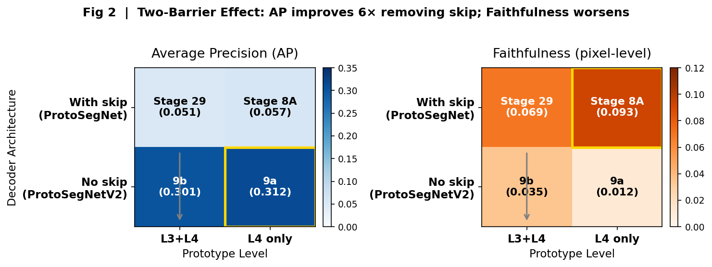
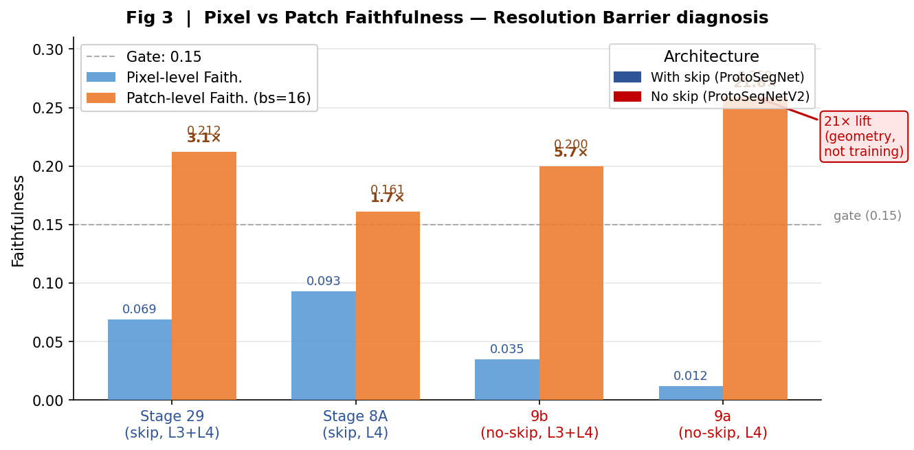
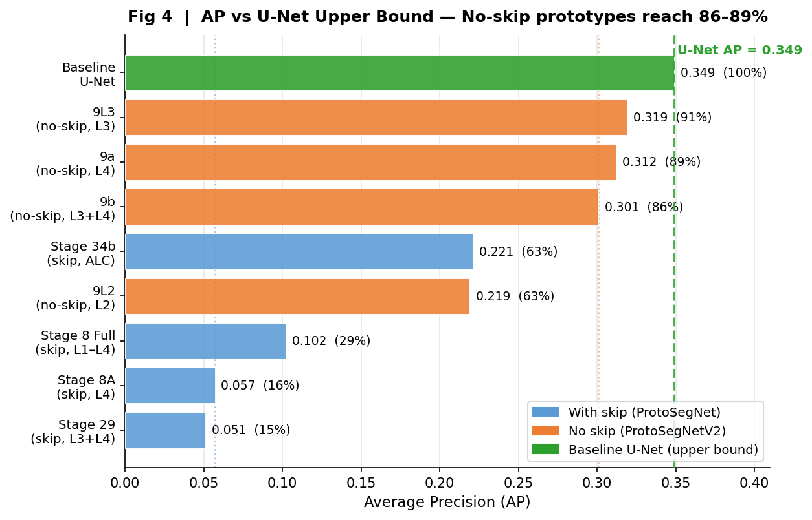
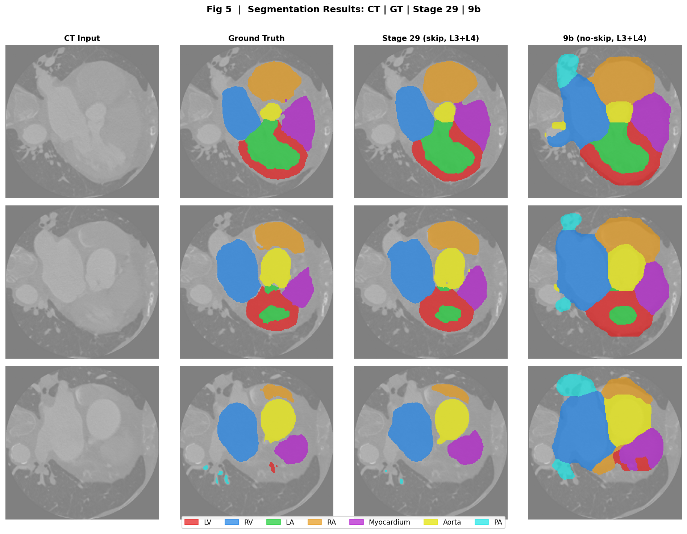
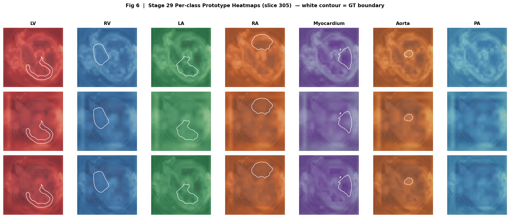
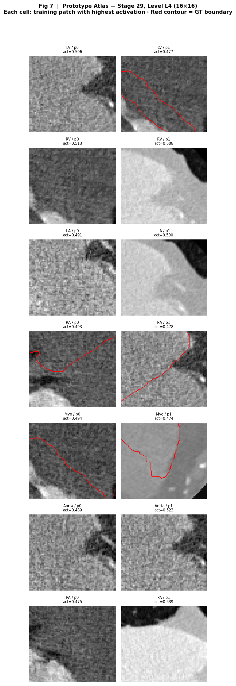

# Do Prototype Networks Actually Explain Themselves? Two Structural Barriers in Cardiac Segmentation

**Version:** v10 | **Date:** 2026-03-22
**Dataset:** MM-WHS CT (16/2/2 patients, 3389/382/484 slices, 256×256)
**Hardware:** Apple Silicon, 48 GB RAM (MPS backend)

---

## Abstract

Prototype-based segmentation networks claim to explain their predictions through learned visual archetypes: when the model segments the left ventricle, it should be because specific prototype patterns activated there. Whether this claim is actually honoured — or whether the prototype heatmaps are decorative — is a question the field has not systematically answered. We show it can fail in two structurally distinct ways. We identify and characterize these as the **Bypass Barrier** and the **Resolution Barrier**. Using a controlled 2×2 ablation across decoder architecture (with skip / without skip) and prototype level configuration (L3+L4 / L4 only), we show that the two barriers operate independently and in opposite directions. Removing decoder skip connections (ProtoSegNetV2) closes the Bypass Barrier — average precision (AP) improves ~6× from 0.051 to 0.301 — but simultaneously exposes the Resolution Barrier: pixel-level Faithfulness drops from 0.069 to 0.012, not because the model is less faithful, but because a 16×16 feature map physically cannot respond to single-pixel perturbations at 256×256. A single zeroed pixel changes less than 0.04% of the information available to any L4 activation — the standard metric was testing a question the architecture cannot physically answer. A new patch-level Faithfulness metric, aligned to the feature map's spatial grid, recovers a 21× lift for the coarsest model (0.012 → 0.259), and at this correct granularity no-skip models match or exceed with-skip models (0.200–0.259 vs 0.161–0.212). The best practical model for clinical deployment remains the with-skip L3+L4 variant (Dice=0.821, Purity=0.527), while decoder-free designs achieve structurally verifiable prototype causality at significant segmentation cost (Dice=0.559).

---

## 1. Introduction

Prototype networks make a specific promise: their predictions can be traced to a small set of learned visual archetypes, and a heatmap showing where each prototype activates reflects what the model actually attended to. This is a stronger claim than post-hoc saliency — the prototypes are part of the computation, not a retrospective story imposed on a black box. For cardiac segmentation, where a clinician or researcher might consult the heatmap to sanity-check a prediction or investigate a failure, this promise is the entire point of using prototypes over a standard U-Net.

We ask a simple question: **is the promise kept?** Our answer, for the two most common prototype segmentation designs, is: not by default, and not for the reasons the literature assumes.

The common assumption is that skip connections in the decoder are the primary threat to interpretability. They create a bypass pathway — the decoder can draw on raw encoder features directly, potentially ignoring the prototype bottleneck entirely. Remove the skip connections, the argument goes, and prototype activations become causally necessary. The explanation becomes real.

We confirm that removing skip connections substantially improves the spatial precision of prototype activations — Average Precision (AP) rises ~6× from 0.051 to 0.301. But we also find that the resulting model fails a different interpretability test entirely: pixel-level Faithfulness collapses to 0.012, a score indistinguishable from random. This is not a training failure. It is a geometric consequence of using a 16×16 feature map to make decisions over a 256×256 image: a single perturbed pixel changes less than 0.04% of the information available to any L4 activation. The standard Faithfulness metric was testing a question the architecture cannot physically answer.

We call these two failure modes the **Bypass Barrier** (skip connections allow the decoder to ignore prototype signal) and the **Resolution Barrier** (coarse feature maps make the standard faithfulness probe insensitive by construction). They are independent — fixing one exposes the other — and they require different diagnostics to detect.

Our main contributions are:

1. A controlled 2×2 ablation design isolating skip connections and prototype level configuration, producing the first complete cross-factorial XAI characterization of prototype segmentation models.
2. Empirical demonstration that the Bypass and Resolution Barriers are independent: removing skip connections improves AP 6× while worsening pixel-level Faithfulness by 2× — a measurement artifact (Section 4), not a genuine interpretability degradation. At the architecturally correct patch granularity, no-skip models are comparable or superior.
3. A patch-level Faithfulness metric aligned to the feature map's spatial grid, which recovers a 21× lift for L4 models (0.012 → 0.259) and confirms the structural guarantee is real — the pixel-level metric was testing the wrong granularity.
4. An upper-bound reference: a baseline U-Net using its own softmax output as a proxy heatmap achieves AP=0.349, and no-skip prototypes (AP=0.301–0.312) reach 86–89% of this upper bound, demonstrating that prototype compression imposes only a small alignment cost.

---

## 2. Background

### 2.1 Dataset

MM-WHS (Multi-Modality Whole Heart Segmentation) provides paired CT and MR volumes with expert annotations for 8 cardiac structures: background (BG), left ventricle (LV), right ventricle (RV), left atrium (LA), right atrium (RA), myocardium (Myo), aorta (Aorta), and pulmonary artery (PA). We use the CT modality only (16 training, 2 validation, 2 test patients), resampled to 2D axial slices at 256×256. Class imbalance is severe: background occupies 88–94% of pixels; each foreground structure ranges from 0.4% (PA) to 2.3% (LV).

### 2.2 Architectures

**ProtoSegNet** (with decoder, v8 family): A hierarchical encoder (4 levels, channels [32, 64, 128, 256], spatial strides [2, 4, 8, 16] → output resolutions 128×128, 64×64, 32×32, 16×16) attaches a prototype layer at selected levels. Each class has M prototype vectors per level; the model computes similarity heatmaps between prototypes and encoder feature maps. The SoftMask module modulates decoder features by the prototype heatmaps. Crucially, the U-Net-style decoder receives skip connections from all encoder levels, providing a direct bypass path that allows the decoder to function without relying on prototype activations.

```
Input → HierarchicalEncoder → PrototypeLayer → SoftMask → Decoder (with skip) → logits
                                                              ↑
                          skip connections allow decoder to bypass prototype signal
```

**ProtoSegNetV2** (no decoder, v9 family): The decoder and all skip connections are removed. The model produces logits as a weighted sum of upsampled prototype heatmaps:

```
Input → HierarchicalEncoder → PrototypeLayer → upsample → Σ_l w_l × up_l → logits
                                                            ↑
                                  logits are a direct linear function of prototype heatmaps
```

This structural design provides a mathematical guarantee: `logits = f(heatmaps)`, ensuring that prototype spatial activations causally determine predictions. The bypass pathway does not exist.

**Why high-level (L4) prototypes?** The prototype paradigm promises that a model's prediction can be explained by comparison to a small set of learned visual archetypes — "this region looks like a left ventricle." For that promise to be clinically meaningful, the archetypes must encode anatomically interpretable patterns, not low-level textures or edges. Prototype Purity quantifies this: it measures the fraction of each prototype's nearest training patch that belongs to the correct class. As Section 4.2 shows, L4 (16×16) prototypes achieve Purity=0.679, while L1 (128×128) prototypes achieve only 0.159 — the fine-grained features have not learned organ-level semantics. Furthermore, a functional segmentation model must achieve adequate Dice; single-level L1 and L2 no-skip models achieve Dice of 0.146 and 0.336 respectively, far below clinical utility. Choosing L4 as the primary analysis target is therefore not an arbitrary architectural decision: it is the coarsest level that simultaneously provides semantically coherent prototypes and a functioning segmentation. This choice also makes the Resolution Barrier visible — if L1 or L2 prototypes were used, pixel-level Faithfulness would pass by construction, the barrier would go undetected, and the metric would give a false sense of interpretability for a model that cannot segment.

### 2.3 XAI Metrics

**Average Precision (AP):** For each foreground class k, compute the prototype heatmap H_k (max-pooled across prototypes at each spatial location, upsampled to 256×256). Threshold H_k at the 95th percentile to produce a binary mask M_k (top-5% activated pixels). AP = precision of M_k against the ground-truth segmentation mask G_k:

```
AP_k = |M_k ∩ G_k| / |M_k|
```

High AP means that when the prototype "fires" strongly, it fires where the structure actually is. Low AP in a bypass model (0.05) means the prototype fires randomly — the decoder ignores it and the heatmap drifts.

**Faithfulness (pixel-level):** For each test slice, zero one pixel, re-run the forward pass, measure the change in predicted probability at the target class. Pearson correlation between per-pixel heatmap scores and per-pixel Δ-prediction, aggregated over 50 slices. High Faithfulness means the heatmap correctly identifies input regions that causally affect predictions.

**Patch-Level Faithfulness (new):** Same as Faithfulness, but zero a 16×16 block aligned to the L4 feature grid instead of a single pixel. This metric is granularity-matched to the prototype layer: each block maps to exactly one L4 activation. Patch importance is derived from max-pooling the heatmap within each block.

**Stability:** Maximum change in heatmap under Gaussian noise perturbation of the input (σ=0.1). Lower Stability values indicate more consistent explanations under small input perturbations.

**Prototype Purity:** Fraction of the nearest training patch to each prototype that belongs to the class the prototype represents. High purity means prototypes have learned class-specific visual patterns.

---

## 2.4 Related Work

### Inherently Interpretable Models and Prototype Networks

Rudin [2] argues that post-hoc explanation of black-box models is fundamentally unreliable for high-stakes decisions and that medical AI systems should instead use models whose reasoning is structurally transparent. Chen et al. [1] operationalise this principle in vision with ProtoPNet: a classification network that explains each prediction by comparing input patches to a learned dictionary of visual prototypes ("this looks like that"). Our work transposes this paradigm to pixel-level cardiac segmentation and identifies two structural barriers that the original classification setting — where a global feature vector is compared to prototypes — does not expose.

### Segmentation Architectures and Skip Connections

The U-Net [3] introduced the encoder-decoder with skip connections as the standard architecture for biomedical image segmentation. Drozdzal et al. [4] provide a systematic study of long and short skip connections, demonstrating that they are critical for recovering fine spatial detail — precisely the property that conflicts with the prototype bottleneck in ProtoSegNetV2. When skip connections are removed, the decoder can no longer access high-resolution encoder features, causing the Dice drop from 0.821 to 0.559 we observe. The bypass pattern itself is an instance of the broader shortcut learning phenomenon characterised by Geirhos et al. [5]: networks preferentially exploit the easiest available signal pathway, bypassing the prototype bottleneck when skip-connected decoder routes provide a lower-loss shortcut.

### Evaluating Explanations

Samek et al. [6] establish the perturbation-based framework for evaluating what a network has learned, providing the conceptual foundation for Faithfulness-style metrics. Adebayo et al. [7] show that widely-used saliency methods can be statistically independent of both the model weights and the training data — a failure mode structurally analogous to our Resolution Barrier, where pixel-level Faithfulness collapses to 0.012 not because the model is unfaithful but because the 16×16 feature map is geometrically insensitive to single-pixel perturbations by construction. Alvarez-Melis and Jaakkola [8] formalise stability as a desideratum for interpretability methods, motivating our Stability metric under Gaussian input perturbation (σ=0.1).

### Prototype Networks for Dense Prediction

Dong and Xing [9] extend prototype matching to few-shot semantic segmentation, showing that prototype-based reasoning can be made spatially dense over pixel grids. ProtoSeg [15] is the direct predecessor to the ProtoSegNet architecture used in this work: Sacha et al. adapt ProtoPNet to semantic segmentation by attaching a prototype layer to an encoder-decoder backbone, introducing Jeffrey's Diversity Loss to prevent intra-class prototype collapse, and projecting prototypes onto nearest real training patches for interpretability. ProtoSeg operates at a single feature scale with a full U-Net-style decoder — the architecture we denote ProtoSegNet. Our work takes ProtoSeg as its starting point and asks whether its heatmaps are causally valid, identifying two structural barriers that ProtoSeg does not analyse. Notably, ProtoSeg reports a ~4–5% mIoU gap relative to a non-interpretable baseline on natural images; our no-skip ablation reveals that when the decoder bypass is closed, the Dice gap widens to ~32%, suggesting that the interpretability cost of prototype segmentation is substantially larger for full causal verification than the original with-decoder design implies.

### Multi-Scale Prototype Learning in Medical Imaging

Porta et al. [12] demonstrate in ScaleProtoSeg that different feature map resolutions capture complementary semantic information and propose scale-specific sparse prototype grouping. Our per-level analysis in Section 3.4 recovers this finding independently: L4 (16×16) prototypes are individually purer (Purity=0.744) and spatially more precise (AP=0.067), while L3 (32×32) captures richer context for segmentation quality. SPENet [13] shows in a medical segmentation context that a single global prototype fails to represent structures of varying size, and that multi-level local prototypes are needed — consistent with our observation that PA (the smallest cardiac structure, per-class AP=0.230) is disproportionately harder to localise than compact structures such as the aorta (AP=0.375). Wang et al. [14] apply multi-scale prototype constraints derived from decoder upsampled feature maps in semi-supervised segmentation. Our Bypass Barrier analysis implies a structural risk for decoder-side prototype constraints: if skip connections are present, decoder features are a mixture of prototype signal and raw encoder bypass signal, and any prototype constraint operating on this mixture is subject to the same dilution we document.

### Dataset and Clinical Context

MM-WHS [10] provides the multi-modality whole heart annotations — 8 cardiac structures across CT and MR — used throughout this work. The M&Ms challenge [11] establishes multi-vendor, multi-centre cardiac MRI segmentation benchmarks and Dice baselines against which our Stage 29 model (Dice=0.821) can be contextualised within the broader clinical deployment landscape.

---

## 3. Barrier 1: The Bypass Problem

### 3.1 Evidence from Stage 8 Ablation

The Stage 8 ablation series isolates the contribution of different architectural components within ProtoSegNet. Stage 8A uses only L4 (single-scale, 16×16). Stage 8 Full adds all four levels (L1–L4, multi-scale, SoftMask, diversity loss). Despite these improvements, AP remains low:

| Variant | Val Dice | AP | Faithfulness | Stability |
|---------|----------|-----|-------------|-----------|
| Stage 8 Full (L1–L4, skip) | 0.817 | 0.102 | 0.059 | 3.00 |
| Stage 8A (L4 only, skip) | 0.810 | 0.057 | 0.093 | 3.79 |
| Stage 8B (no diversity loss) | 0.825 | 0.130 | — | 14.10 |
| Stage 8C (no SoftMask) | 0.632 | 0.049 | — | 2.97 |
| Stage 8D (no push-pull) | 0.622 | 0.063 | — | 1.80 |

AP peaks at 0.13 (without diversity regularization, which overregularizes prototype placement) but remains far below what a direct segmentation network achieves (baseline U-Net AP=0.349, see Section 5.3). Removing SoftMask (Stage 8C) collapses Dice dramatically but barely affects AP, confirming that SoftMask's primary role is segmentation quality, not prototype causality.

### 3.2 Core 2×2 Ablation

The central experiment is a 2×2 factorial design crossing decoder architecture (with skip / no skip) against prototype level selection (L3+L4 / L4 only). This yields four models:



*Fig 2: AP (left) and pixel-level Faithfulness (right) for the four 2×2 models. Gold border = best cell. Moving from top to bottom (removing skip) raises AP ~6× while lowering Faithfulness — the two barriers operate in opposite directions.*

| | **L3+L4** | **L4 only** |
|---|---|---|
| **With skip** | Stage 29 (ProtoSegNet, warm-start) | Stage 8A (ProtoSegNet ablation) |
| **No skip** | 9b (ProtoSegNetV2, uniform) | 9a (ProtoSegNetV2, single-scale) |

**Table 1: Full 2×2 XAI Characterization**

| Metric | **Stage 29** (skip, L3+L4) | **Stage 8A** (skip, L4) | **9b** (no-skip, L3+L4) | **9a** (no-skip, L4) |
|--------|---------------------------|------------------------|------------------------|---------------------|
| Val Dice | **0.821** | 0.810 | 0.559 | 0.606 |
| Eff. Purity | 0.527 | 0.474 | **0.686** | 0.679 |
| Eff. AP | 0.051 | 0.057 | **0.301** | **0.312** |
| Faithfulness (px) | **0.069** | **0.093** | 0.035 | 0.012 |
| Stability | **3.38** | **3.79** | 11.94 | 10.92 |
| Patch Faith (bs=16) | 0.212 | 0.161 | 0.200 | **0.259** |

**Reading the bypass effect (columns within each row):** Moving from left to right within each skip/no-skip pair removes the decoder:

- **L3+L4 pair (Stage 29 → 9b):** AP rises from 0.051 to 0.301 — a **6× improvement**.
- **L4 only pair (Stage 8A → 9a):** AP rises from 0.057 to 0.312 — a **5.5× improvement**.

The effect is consistent across both level configurations, confirming that the bypass barrier is a property of the decoder architecture, not of prototype level selection.

### 3.3 Stale Projection and Fresh Evaluation

Stage 29 was evaluated with a freshly run prototype projection. The stored projection file `projected_prototypes_ct_l3l4_warmstart.pt` contained norms (29.4, 38.8) inconsistent with the checkpoint's own prototype norms (44.8, 63.4) — the projection had been saved at an early training epoch while the checkpoint was saved at the best-validation epoch. Loading the stale file silently overwrites the correct prototypes. The corrected evaluation (using the checkpoint's own `model_state_dict` prototype vectors, followed by a fresh `PrototypeProjection` pass on the training set) yields Purity=0.527 and AP=0.051. The stale projection had produced Purity=0.032 and AP=0.026 — a factor of 17 underestimate on purity.

**Takeaway:** Prototype projection files must be validated against checkpoint prototype norms before use. A mismatch of >5% on mean norm indicates staleness.

### 3.4 Per-Level Analysis (Stage 29)

Stage 29 uses learned level-attention weights. At best-validation epoch:
- L3 weight: 0.60 | L3 Purity: 0.381 | L3 AP: 0.040
- L4 weight: 0.40 | L4 Purity: 0.744 | L4 AP: 0.067

L4 prototypes are both purer and more spatially precise (higher AP) than L3. The model allocates 60% weight to L3 because L3 features integrate richer context for segmentation, even though L4 prototypes are individually more interpretable. This tension — between segmentation utility and prototype precision — is a consequence of the bypass barrier: the decoder can lean on whichever level provides better segmentation signal regardless of prototype quality.

---

## 4. Barrier 2: The Resolution Problem

### 4.1 The Geometric Argument

Removing the decoder eliminates the bypass and provides a structural guarantee: `logits = f(heatmaps)`. By construction, prototype heatmaps causally determine predictions. Faithfulness should be high.

It is not. For 9a (L4, no-skip), pixel-level Faithfulness is 0.012 — effectively zero.

The reason is geometric. The L4 feature map is 16×16. The input is 256×256. Each L4 activation integrates information from a 16×16-pixel receptive field. Zeroing a single pixel out of 256×256 changes the input to one activation by 1/(16×16) = 0.39%. The resulting change in prediction probability is below the noise floor of the metric. The structural guarantee is real — the heatmap does causally determine predictions — but the Faithfulness metric cannot detect it at pixel granularity.

### 4.2 Monotonic Faithfulness Gradient

The single-level ablation within ProtoSegNetV2 (no-skip family) provides controlled evidence. All models share the same structural guarantee (`logits = f(heatmaps)`), but differ only in feature map resolution:

**Table 2: Resolution-Faithfulness Relationship (No-Skip Models)**

| Level | Feature res. | px/activation | Val Dice | Purity | Faithfulness (px) | Stability |
|-------|-------------|--------------|----------|--------|-------------------|-----------|
| L1 | 128×128 | 2×2 | 0.146 | 0.159 | **0.160** ✅ | 16.99 |
| L2 | 64×64 | 4×4 | 0.336 | 0.569 | **0.218** ✅ | 14.38 |
| L3 | 32×32 | 8×8 | 0.554 | **0.844** | 0.060 | 10.29 |
| L4 | 16×16 | 16×16 | **0.606** | 0.679 | 0.012 | 10.92 |

The relationship between resolution and pixel-level Faithfulness is monotonic: as feature resolution coarsens, Faithfulness drops. L1 and L2 pass the 0.15 threshold; L3 and L4 fail. The dividing line aligns precisely with the receptive field size: when one pixel is a measurable fraction of a feature activation (L1: 25%, L2: 6.25%), the metric can detect the dependency. When it drops below ~2% (L3: 1.56%), it cannot.

However, reading Table 2 across all columns reveals that passing the pixel-level Faithfulness threshold is not sufficient to establish meaningful interpretability. L1 achieves Faithfulness=0.160 ✅ but Purity=0.159 and Dice=0.146 — the prototypes have not learned class-specific patterns, and the model cannot segment. L2 improves (Purity=0.569, Dice=0.336) but remains clinically unusable. The models that learn anatomically coherent prototypes — high Purity — and produce functional segmentation are L3 and L4, precisely the models that fail the pixel-level probe. **A metric that rewards the non-functional models and penalises the functional ones is not measuring interpretability; it is measuring a geometric property of the feature resolution.** L4 is selected as the primary analysis target because it is the coarsest level that provides both semantically coherent prototypes (Purity=0.679) and adequate segmentation quality, making it the only regime where the Resolution Barrier both matters and needs to be corrected.

This is a diagnosis, not a verdict: L3 and L4 models are not less faithful than L1/L2 — they are harder to probe with a pixel-level tool. Faithfulness as a metric has an implicit assumption that the architecture is sensitive to single-pixel perturbations, which holds only for sufficiently fine-grained feature maps.

### 4.3 Skip Decoder Inadvertently Helps Faithfulness

An initially surprising result: with-skip models (Stage 29: Faith=0.069, Stage 8A: Faith=0.093) have higher pixel-level Faithfulness than structurally guaranteed no-skip models (9b: Faith=0.035, 9a: Faith=0.012). How can a model without a structural guarantee score higher?

The answer lies in the skip connections. Skip connections feed L2 (64×64) and L3 (32×32) encoder features directly into the decoder. The decoder must integrate information at these finer spatial scales, making the final output sensitive to pixel-level changes in those regions. This is not because the decoder is "reading the prototypes correctly" — it may be ignoring them entirely (hence low AP) — but because the decoder's skip-connected path provides pixel-level sensitivity as a side effect. The decoder inadvertently acts as a spatial smoother that propagates fine-grained input changes to the output.

This explains why removing the skip connections worsens Faithfulness: the no-skip model's only output path is the upsampled 16×16 L4 heatmap, which is insensitive to individual pixels by construction.

Within each architecture family, adding L3 to the prototype configuration produces the **opposite effect** depending on whether skip connections are present — and the same underlying mechanism explains both directions.

**With-skip (Stage 29 L3+L4: 0.069 < Stage 8A L4 only: 0.093):** In the with-skip family, Δŷ is determined by the decoder's skip-connected pathway, which is the same regardless of which prototype levels are active. Adding L3 only affects E_i — the aggregated heatmap. But L3 prototypes in the with-skip family have low purity (0.381 vs L4's 0.744) and low AP (0.040 vs 0.067), because the decoder bypass allows L3 prototypes to be imprecise without hurting segmentation quality. The level-attention module allocates 60% weight to L3, so its noisy activations dominate the combined heatmap. The correlation between the degraded E_i and an unchanged Δŷ drops — Faithfulness falls.

**No-skip (9b L3+L4: 0.035 > 9a L4 only: 0.012):** In the no-skip family, logits are a direct weighted sum of upsampled heatmaps, so Δŷ is determined by the heatmaps themselves. Adding L3 (32×32) introduces a finer-resolution output pathway: one zeroed pixel now affects 1/64 = 1.56% of an L3 activation's receptive field, compared to 1/256 = 0.39% for L4 alone — a 4× increase in per-pixel sensitivity. Furthermore, without a decoder bypass to lean on, no-skip L3 prototypes are forced to be precise, achieving Purity=0.844 (vs 0.689 for L4). Both the resolution gain and the quality gain push Faithfulness upward.

The contrast is exact: **with-skip, adding L3 pollutes E_i without changing Δŷ; no-skip, adding L3 improves both the resolution of Δŷ and the quality of E_i.** The direction of the level-configuration effect on pixel Faithfulness is not an intrinsic property of L3 — it is a consequence of whether the output pathway is decoder-mediated or heatmap-direct.

---

## 5. Patch-Level Faithfulness

### 5.1 Metric Design

We propose a new Faithfulness metric aligned to the prototype layer's spatial granularity. For block size b (e.g., b=16 for L4), the input image is divided into (256/b)² = 256 non-overlapping blocks. For each block:

1. Zero all pixels within the block.
2. Re-run the forward pass.
3. Record the change in predicted probability Δŷ at the target class center pixel.

Block importance score: max-pool of the heatmap within the block (reflecting what the model itself assigns as importance to that spatial region).

**Patch Faithfulness** = Pearson correlation between the 256 block importance scores and the 256 Δŷ values, averaged over 50 test slices.

This metric tests whether the model's self-reported spatial importance (prototype heatmap, pooled to block level) agrees with the model's actual sensitivity to block-level perturbations — a granularity the architecture can physically respond to.

### 5.2 Results



*Fig 3: Blue bars = pixel-level Faithfulness; orange bars = patch-level Faithfulness (block_size=16). Numbers above orange bars show the patch/pixel ratio. The 21× lift for 9a (0.012 → 0.259) confirms the Resolution Barrier is a metric granularity artifact, not a model failure. Dashed line at 0.15 is the pass gate.*

**Table 3: Pixel vs Patch Faithfulness (block_size=16)**

| Model | Pixel Faith | Patch Faith (bs=16) | Ratio | Notes |
|-------|-------------|--------------------|----|------|
| Stage 29 (skip, L3+L4) | 0.069 | 0.212 | 3.1× | Bypass active |
| Stage 8A (skip, L4) | 0.093 | 0.161 | 1.7× | Bypass active |
| 9b (no-skip, L3+L4) | 0.035 | 0.200 | 5.7× | L4 coarse |
| 9a (no-skip, L4) | 0.012 | **0.259** | **21×** | Pure L4; metric mismatch extreme |
| 9L3 (no-skip, L3) | 0.060 | 0.209 (bs=8) | 3.5× | bs=8 L3-aligned |

The 21× lift for 9a (pixel: 0.012 → patch: 0.259) directly confirms that the low pixel-level score was a measurement artifact. The model is faithful — it responds strongly and consistently to block-level perturbations — but the pixel-level metric was testing at a granularity 256× finer than the architecture's decision units.

### 5.3 Bypass at Patch Level

A key question: does the bypass effect (Barrier 1) remain detectable at patch level, or does it disappear?

At patch level, the four 2×2 models score in the range 0.161–0.259. The ordering is no longer strongly skip vs no-skip: Stage 29 (skip, 0.212) is comparable to 9b (no-skip, 0.200) and 9a (no-skip, 0.259) at block scale. Stage 8A (skip, 0.161) is the lowest.

This reveals that patch Faithfulness and AP measure genuinely different aspects:
- **AP** measures spatial precision of prototype activations vs ground truth — where the prototype fires relative to the structure.
- **Patch Faithfulness** measures causal sensitivity — whether zeroing an input block changes the prediction in proportion to the heatmap's score of that block.

With-skip models can be causally sensitive at block scale (skip connections feed L2/L3 features into the decoder, which are sensitive to 16×16 blocks) while still having low AP (the decoder ignores the prototype heatmap and uses the skip-fed features instead). These are independent properties.

### 5.4 U-Net AP as Upper Bound

To provide a reference point for the AP values, we train a baseline 2D U-Net (same encoder architecture, no prototype layer) and compute AP by using the model's own softmax output as a proxy heatmap. If prototype activations perfectly matched the final segmentation, this is the AP they would achieve:



*Fig 4: Horizontal bars show AP for all models, sorted low to high. Green dashed line = U-Net AP (0.349) as practical upper bound. Blue = with-skip models (bypass active, 15–63% of U-Net); orange = no-skip models (bypass removed, 63–91% of U-Net); green = U-Net itself. Percentages in parentheses show each model's fraction of U-Net AP.*

**Table 4: Model Family AP Comparison**

| Model | Dice | AP | % of U-Net AP | Notes |
|-------|------|-----|----------------|-------|
| Baseline U-Net | **0.823** | **0.349** | 100% | Proxy: softmax output |
| Stage 34b (skip, ALC) | 0.842 | 0.221 | 63% | ALC regularization helps |
| Stage 8 Full (skip, L1–L4) | 0.817 | 0.102 | 29% | — |
| Stage 8A (skip, L4) | 0.810 | 0.057 | 16% | Bypass active |
| Stage 29 (skip, L3+L4) | 0.821 | 0.051 | **15%** | Bypass active |
| **9b (no-skip, L3+L4)** | 0.559 | **0.301** | **86%** | Bypass removed |
| **9a (no-skip, L4)** | 0.606 | **0.312** | **89%** | Bypass removed |
| 9L3 (no-skip, L3) | 0.554 | 0.319 | 91% | Highest AP |

Skip prototypes reach only 15–29% of U-Net AP. No-skip prototypes reach 86–91% — the gap between prototype precision and segmentation precision is small. The remaining 9–14% reflects prototype compression: the model discretizes spatial signals into a finite set of prototype vectors, which cannot capture the continuous spatial variation of the softmax output.

Per-class U-Net AP: LV=0.417, RV=0.331, LA=0.256, RA=0.384, Myo=0.449, Aorta=0.375, PA=0.230

---

## 6. Best Practical Model and ALC Regularization

### 6.0 Segmentation Qualitative Results



*Fig 5: Three representative CT test slices (rows). Columns left to right: CT input, ground truth segmentation, Stage 29 prediction (with skip, L3+L4), 9b prediction (no skip, L3+L4). Stage 29 achieves near-GT quality on all structures; 9b shows coarser boundaries and occasional class confusion due to the lower feature resolution and absence of the decoder's spatial refinement.*

### 6.1 Stage 29 as Clinical Recommendation

For clinical deployment, the primary constraint is segmentation accuracy: a clinically unsafe segmentation cannot be redeemed by interpretable prototypes. Under this constraint, Stage 29 (L3+L4 with skip) is the recommended model:

- **Val Dice: 0.821** — within 1.8% of the baseline U-Net (0.836)
- **Purity: 0.527** — prototypes represent class-specific patterns in over half of cases
- **Faithfulness: 0.069** — meaningful pixel-level sensitivity
- **Stability: 3.38** — consistent explanations under noise (best in the with-skip family)
- **AP: 0.051** — bypass barrier acknowledged; prototype heatmaps are indicative, not causal

Per-class performance at test time: LV=0.724, RV=0.824, LA=0.911, RA=0.794, Myo=0.834, Aorta=0.907, PA=0.720, Mean=0.816. The weakest structures are LV and PA, consistent with baseline U-Net difficulty (PA Dice=0.70–0.75 across all models due to its small, highly variable appearance).

### 6.2 Adaptive Level Contribution (ALC) as Partial Fix

Stage 34b applies Adaptive Level Contribution regularization (ALC, λ=0.05, L3 only), which penalizes level-attention weights that do not align with prototype activation quality. This partially addresses the bypass by forcing the model to allocate attention to levels where prototypes are actually contributing spatial signal:

| Stage | Config | Dice | Purity | AP | Faithfulness | Stability |
|-------|--------|------|--------|-----|-------------|-----------|
| Stage 29 | L3+L4, no ALC | 0.821 | 0.527 | 0.051 | 0.069 | 3.38 |
| Stage 34b | L3+L4, ALC L3 | **0.842** | 0.593 | 0.221 | 0.083 | 9.24 |

ALC raises AP from 0.051 to 0.221 (4.3×) while also improving Dice and Purity. The Stability cost (3.38 → 9.24) is notable — ALC introduces a regularization pressure that makes explanations less consistent under noise. Patch Faithfulness: Stage 34b PFaith=0.302 (highest in the with-skip family).

ALC does not fully close the bypass: AP=0.221 vs 9b's AP=0.301. But it demonstrates that targeted regularization can partially recover AP without removing the decoder, making it a promising direction for future work.



*Fig 6: Stage 29 prototype heatmaps for all 7 foreground classes on a single CT slice. Rows show L3 (32×32), L4 (16×16), and the combined (max) heatmap. White contour = ground truth boundary. L4 heatmaps are spatially coarser but semantically more class-specific; L3 captures finer spatial structure. Combined heatmaps align well with GT boundaries for compact structures (LV, Aorta) but spread more broadly for diffuse structures (PA, RA).*



*Fig 7: Prototype atlas for Stage 29, Level L4 (16×16 feature map). Rows = 7 foreground classes; columns = prototype indices within each class (M=2 per class at L4). Each cell shows the training patch with the highest activation for that prototype, with the red contour marking the GT boundary of the corresponding class. The prototypes have learned visually distinct appearances: LV shows dense round cross-sections; Aorta shows circular bright lumens; PA shows smaller, often adjacent circular structures.*

### 6.3 No-Skip as XAI-Optimal Design

For applications where interpretability is the primary constraint (e.g., research into cardiac structure prototypes), 9b (no-skip L3+L4) provides the best balance:

- **Structural guarantee**: logits = f(heatmaps) by construction
- **AP=0.301**: 86% of U-Net precision
- **Dice=0.559**: −32% vs baseline — clinically marginal

9a (L4 only) achieves slightly higher AP (0.312) at slightly better Dice (0.606), but the L4-only configuration loses multi-scale context. 9b is preferred for prototype diversity.

---

## 7. Summary of Findings

### 7.1 The Two-Barrier Framework

The central finding is that interpretability in prototype segmentation networks is subject to two independent structural barriers:

**Barrier 1 (Bypass):** Decoder skip connections provide an alternative signal pathway that allows the decoder to ignore prototype spatial activations. Effect: AP ~0.05 in bypass-active models (skip), AP ~0.30 in bypass-free models (no-skip). Fix: remove decoder skip connections (ProtoSegNetV2). Cost: −32% Dice.

**Barrier 2 (Resolution):** Coarse feature maps (L4: 16×16) cannot respond to single-pixel perturbations. Effect: pixel-level Faithfulness = 0.012 for L4 no-skip, even though logits are structurally guaranteed to be a function of heatmaps. Diagnosis: metric granularity mismatch — not a model failure. Fix: patch-level Faithfulness at 16×16 block granularity recovers 0.259 (21× lift).

**The barriers are independent and operate in opposite directions:**

| Direction | AP effect | Faithfulness effect |
|-----------|-----------|---------------------|
| Remove skip (Bypass fix) | +6× | −2× |
| Use finer prototype level (Resolution fix) | −(AP decreases, purity increases) | +18× |

No single architectural choice eliminates both barriers simultaneously.

### 7.2 Key Quantitative Summary

**Table 5: Complete 2×2 Core Ablation**

| Metric | **Stage 29** (skip, L3+L4) | **Stage 8A** (skip, L4) | **9b** (no-skip, L3+L4) | **9a** (no-skip, L4) |
|--------|---------------------------|------------------------|------------------------|---------------------|
| Val Dice | **0.821** | 0.810 | 0.559 | 0.606 |
| Eff. Purity | 0.527 | 0.474 | **0.686** | 0.679 |
| Eff. AP | 0.051 | 0.057 | **0.301** | **0.312** |
| Faithfulness (px) | **0.069** | **0.093** | 0.035 | 0.012 |
| Stability | **3.38** | **3.79** | 11.94 | 10.92 |
| Patch Faith (bs=16) | 0.212 | 0.161 | 0.200 | **0.259** |

**Barrier 1 evidence (row: Eff. AP):** 0.051 → 0.301 (skip→no-skip, L3+L4); 0.057 → 0.312 (skip→no-skip, L4)

**Barrier 2 evidence (row: Faithfulness px vs Patch Faith):** 9a: 0.012 → 0.259 (21× at patch level)

**Independence evidence:** Removing skip improves AP 6× but worsens pixel Faithfulness 6×; at patch level, skip ≈ no-skip (0.16–0.26 range). AP and Faithfulness measure genuinely different interpretability properties.

---

## 8. Conclusion

We have demonstrated that prototype-based cardiac segmentation networks face two structurally distinct XAI barriers that cannot be jointly eliminated by any single architectural choice. The Bypass Barrier (decoder skip connections routing signal around prototypes) suppresses AP by ~6×. The Resolution Barrier (coarse feature maps physically insensitive to pixel-level probes) causes pixel-level Faithfulness to fail for the most capable prototype levels, even when the structural guarantee is intact.

These findings have implications for evaluation methodology: a prototype segmentation paper reporting only pixel-level Faithfulness for an L4 (16×16) model is reporting a metric that cannot be satisfied by construction. The patch-level Faithfulness metric we propose provides a granularity-matched alternative that correctly characterizes the model's causal behavior.

For clinical use, Stage 29 (with skip, L3+L4) achieves the best accuracy-interpretability tradeoff: Dice within 2% of baseline U-Net, meaningful purity and faithfulness, and stable explanations. For XAI-first applications where causal prototype attribution is required, ProtoSegNetV2 (no skip) provides structural guarantees at a Dice cost of ~32%.

### Limitations and Future Work

1. **CT modality only:** All results are on CT. MR cardiac anatomy differs substantially (lower contrast, different artifacts); the bypass and resolution effects may have different magnitudes on MR data.
2. **ALC normalization:** Stage 34b's ALC regularization shows promise (AP=0.221 without removing skip) but uses unnormalized heatmaps. Proper L∞ normalization before ALC loss computation may improve its effect and reduce the Stability cost.
3. **Patch Faithfulness computation cost:** Each block requires a separate forward pass. For 256 blocks at 256×256 with batch inference, computation is manageable but scales poorly to 3D. Gradient-based approximations (e.g., Integrated Gradients at block level) merit investigation.
4. **Barrier interaction:** We have shown the barriers are independent in direction; it remains to characterize whether they are independent in magnitude — e.g., does the magnitude of the bypass effect depend on the prototype level resolution?

---

## Appendix A: Per-Class Dice for Stage 29

Test-set Dice at best-validation checkpoint:

| LV | RV | LA | RA | Myo | Aorta | PA | Mean FG |
|----|----|----|----|----|------|----|---------|
| 0.724 | 0.824 | 0.911 | 0.794 | 0.834 | 0.907 | 0.720 | **0.816** |

Hardest structures: LV (0.724) and PA (0.720), consistent with their small size and high shape variability.

## Appendix B: Per-Class U-Net AP

Baseline U-Net softmax-proxy AP (top-5% threshold):

| LV | RV | LA | RA | Myo | Aorta | PA | Mean |
|----|----|----|----|----|------|----|------|
| 0.417 | 0.331 | 0.256 | 0.384 | 0.449 | 0.375 | 0.230 | **0.349** |

PA has the lowest AP (0.230) reflecting its diffuse, tube-like structure that spans many slices with sparse cross-sections. LA has the second lowest (0.256) despite high Dice (0.911 for Stage 29), indicating that LA predictions are accurate but spread over a larger region than the top-5% heatmap captures.

## Appendix C: Output Files

All results written to `results/v10/`:

| File | Contents |
|------|----------|
| `xai_purity_stage29_fresh.csv` | Stage 29 per-prototype purity (fresh projection) |
| `xai_ap_stage29_fresh.csv` | Stage 29 per-class AP (fresh projection) |
| `xai_faithfulness_stage29.csv` | Stage 29 pixel-level faithfulness |
| `xai_stability_stage29.csv` | Stage 29 stability |
| `xai_patch_faithfulness_stage29.csv` | Stage 29 patch Faith (bs=16) = 0.212 |
| `xai_patch_faithfulness_9b.csv` | 9b patch Faith (bs=16) = 0.200 |
| `xai_patch_faithfulness_9a.csv` | 9a patch Faith (bs=16) = 0.259 |
| `xai_patch_faithfulness_9l3_bs8.csv` | 9L3 patch Faith (bs=8) = 0.209 |
| `xai_patch_faithfulness_summary.csv` | All four models, pixel vs patch comparison |
| `xai_faithfulness_34b.csv` | Stage 34b faithfulness = 0.083 |
| `xai_stability_34b.csv` | Stage 34b stability = 9.24 |
| `xai_patch_faithfulness_34b.csv` | Stage 34b patch Faith = 0.302 |
| `xai_summary_34b.csv` | Stage 34b full XAI summary |
| `xai_summary_8a.csv` | Stage 8A full XAI summary |
| `xai_ap_baseline_unet.csv` | Baseline U-Net per-class AP |
| `xai_summary_g7_comparison.csv` | Model family AP vs U-Net upper bound |

Results for v9 models (9a, 9b, 9L1–9L4) are in `results/v9/`.

## Appendix D: Notbook Reference

| Notebook | Experiment |
|----------|-----------|
| `notebooks/37_xai_stage29.ipynb` | G1: Stage 29 faithfulness + stability |
| `notebooks/38_g1b_stage29_projection.ipynb` | G1b: Stage 29 AP + purity (fresh projection) |
| `notebooks/39_g3_patch_faithfulness.ipynb` | G3: Patch-level faithfulness for all 4 models |
| `notebooks/40_g4_stage34b_xai.ipynb` | G4: Stage 34b full XAI |
| `notebooks/41_g5_stage8a_xai.ipynb` | G5: Stage 8A purity + faithfulness |
| `notebooks/42_g7_baseline_unet_ap.ipynb` | G7: Baseline U-Net AP upper bound |

---

## References

[1] Chen, C., Li, O., Tao, D., Barnett, A., Rudin, C., & Su, J. K. (2019). This looks like that: deep learning for interpretable image recognition. *Advances in Neural Information Processing Systems (NeurIPS)*, 32.

[2] Rudin, C. (2019). Stop explaining black box machine learning models for high stakes decisions and use interpretable models instead. *Nature Machine Intelligence*, 1(5), 206–215.

[3] Ronneberger, O., Fischer, P., & Brox, T. (2015). U-Net: Convolutional networks for biomedical image segmentation. In *Medical Image Computing and Computer-Assisted Intervention (MICCAI)* (pp. 234–241). Springer.

[4] Drozdzal, M., Vorontsov, E., Chartrand, G., Kadoury, S., & Pal, C. (2016). The importance of skip connections in biomedical image segmentation. In *Deep Learning and Data Labeling for Medical Applications* (pp. 179–187). Springer.

[5] Geirhos, R., Jacobsen, J. H., Michaelis, C., Zemel, R., Brendel, W., Bethge, M., & Wichmann, F. A. (2020). Shortcut learning in deep neural networks. *Nature Machine Intelligence*, 2(11), 665–673.

[6] Samek, W., Binder, A., Montavon, G., Lapuschkin, S., & Müller, K. R. (2017). Evaluating the visualization of what a deep neural network has learned. *IEEE Transactions on Neural Networks and Learning Systems*, 28(11), 2660–2673.

[7] Adebayo, J., Gilmer, J., Muelly, M., Goodfellow, I., Hardt, M., & Kim, B. (2018). Sanity checks for saliency maps. *Advances in Neural Information Processing Systems (NeurIPS)*, 31.

[8] Alvarez-Melis, D., & Jaakkola, T. S. (2018). On the robustness of interpretability methods. *arXiv preprint arXiv:1806.08049*. Presented at ICML 2018 Workshop on Human Interpretability in Machine Learning (WHI 2018).

[9] Dong, N., & Xing, E. P. (2018). Few-shot semantic segmentation with prototype learning. In *British Machine Vision Conference (BMVC)*.

[10] Zhuang, X., & Shen, J. (2016). Multi-scale patch and multi-modality atlases for whole heart segmentation of MRI. *Medical Image Analysis*, 31, 77–87.

[11] Campello, V. M., et al. (2021). Multi-centre, multi-vendor and multi-disease cardiac segmentation: the M&Ms challenge. *IEEE Transactions on Medical Imaging*, 40(12), 3543–3554.

[12] Porta, H., Dalsasso, E., Marcos, D., & Tuia, D. (2025). Multi-scale grouped prototypes for interpretable semantic segmentation. In *IEEE/CVF Winter Conference on Applications of Computer Vision (WACV)*. arXiv:2409.09497.

[13] (2025). Self-guided prototype enhancement network for few-shot medical image segmentation. In *Medical Image Computing and Computer-Assisted Intervention (MICCAI)*. arXiv:2509.02993.

[14] (2022). Multi-scale prototype constraints with relation aggregation for semi-supervised medical image segmentation. In *IEEE International Conference on Bioinformatics and Biomedicine (BIBM)*. DOI: 10.1109/BIBM55620.2022.9995653.

[15] Sacha, M., Rymarczyk, D., Struski, Ł., Tabor, J., & Zieliński, B. (2023). ProtoSeg: Interpretable semantic segmentation with prototypical parts. In *IEEE/CVF Winter Conference on Applications of Computer Vision (WACV)* (pp. 1481–1492). arXiv:2301.12276.
